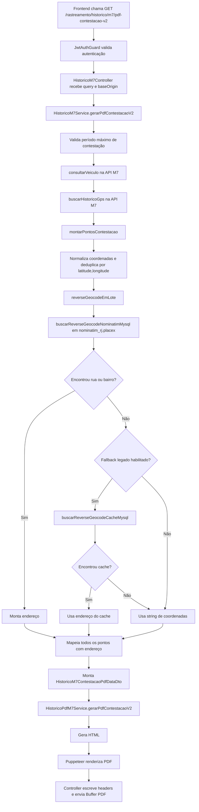
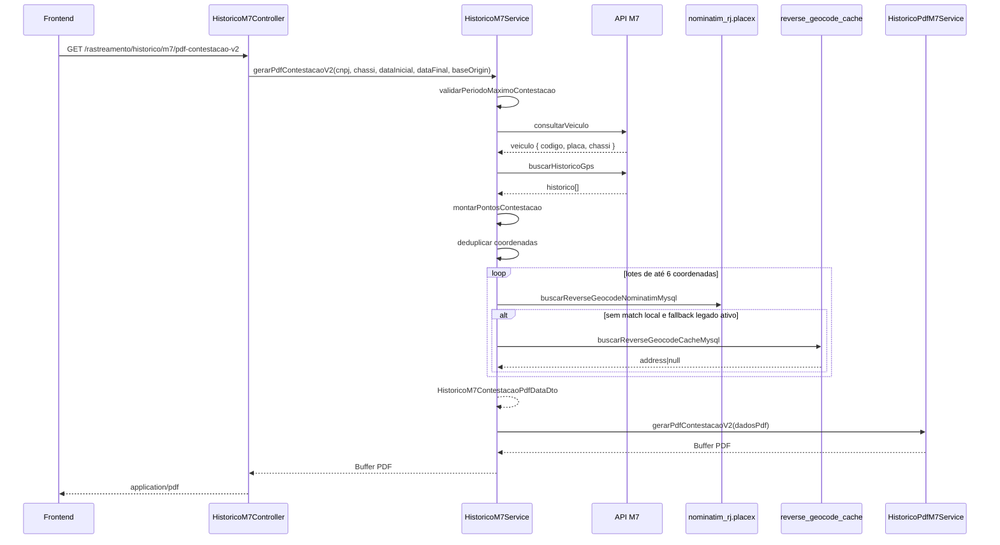

# Fluxo Atual do Relatório M7 de Contestação V2

## 1. Objetivo e Escopo

Este documento descreve exatamente o comportamento atual da implementação responsável por gerar o relatório PDF de contestação V2 do histórico M7.

O fluxo documentado cobre:

- recepção da requisição HTTP autenticada;
- validação dos parâmetros de entrada;
- resolução da base de origem (`BaseOrigin`);
- consulta do veículo na API M7;
- busca do histórico GPS na API M7;
- normalização dos pontos recebidos;
- reverse geocoding usando a base local `nominatim_rj.placex`;
- fallback opcional para a tabela `reverse_geocode_cache`;
- montagem dos dados do relatório;
- geração do HTML e do PDF;
- retorno do PDF ao frontend.

O fluxo principal descrito aqui é o endpoint `GET /rastreamento/historico/m7/pdf-contestacao-v2`.

---

## 2. Visão Geral do Fluxo Completo



Resumo funcional:

1. O frontend envia uma requisição autenticada com `cnpj`, `chassi`, `dataInicial` e `dataFinal`.
2. O controller encaminha esses dados ao serviço de domínio.
3. O serviço valida o período, consulta veículo e histórico GPS na M7.
4. Cada coordenada válida é geocodificada prioritariamente pelo banco local `nominatim_rj.placex`.
5. Os endereços resolvidos são associados aos pontos GPS.
6. Os pontos são agrupados em um DTO específico para contestação.
7. O serviço de PDF transforma o DTO em HTML e depois em PDF.
8. O controller devolve o arquivo PDF inline ao frontend.

---

## 3. Componentes Participantes

## 3.1 Controller

### `HistoricoM7Controller`

Responsabilidades:

- expor os endpoints HTTP do módulo M7;
- proteger os endpoints com `JwtAuthGuard`;
- receber e validar parâmetros de query via DTOs;
- obter `baseOrigin` com `BaseContextService`;
- chamar o serviço de aplicação `HistoricoM7Service`;
- configurar headers HTTP do PDF e enviar o `Buffer` ao frontend.

Endpoint relevante:

- `GET /rastreamento/historico/m7/pdf-contestacao-v2`

Método relevante:

- `gerarPdfContestacaoV2(query, req, res)`

Comportamento atual:

- lê `query.cnpj`, `query.chassi`, `query.dataInicial`, `query.dataFinal`;
- resolve `baseOrigin` por `baseContextService.getBaseOrigin()`;
- registra log da solicitação;
- chama `historicoM7Service.gerarPdfContestacaoV2(...)`;
- monta o nome do arquivo com `chassi` sanitizado;
- define:
  - `Content-Type: application/pdf`
  - `Content-Disposition: inline; filename="..."`
  - `Content-Length`
- envia o `Buffer` do PDF na resposta.

## 3.2 DTOs de Entrada

### `HistoricoM7ContestacaoQueryDto`

Responsabilidades:

- validar a presença dos campos de entrada;
- validar formato de data;
- validar ordem cronológica;
- validar janela máxima para contestação.

Campos:

- `cnpj: string`
- `chassi: string`
- `dataInicial: string`
- `dataFinal: string`

Validações atuais:

- `cnpj` obrigatório;
- `chassi` obrigatório;
- `dataInicial` obrigatória e `IsDateString`;
- `dataFinal` obrigatória e `IsDateString`;
- `dataFinal >= dataInicial`;
- período máximo de 5 dias.

## 3.3 Serviço Principal

### `HistoricoM7Service`

Responsabilidades:

- gerenciar autenticação com a API M7;
- consultar veículo e histórico GPS;
- aplicar filtros de período;
- normalizar coordenadas e dados de pontos;
- executar reverse geocoding local;
- montar DTOs usados pelo relatório;
- delegar a geração física do PDF ao serviço de PDF.

## 3.4 Serviço de PDF

### `HistoricoPdfM7Service`

Responsabilidades:

- gerar HTML do relatório de contestação V2;
- abrir um browser headless com Puppeteer;
- renderizar o HTML;
- exportar o PDF como `Buffer`.

## 3.5 Banco de dados e persistência

### `PrismaService`

Responsabilidades no fluxo atual:

- executar SQL bruto contra `nominatim_rj.placex` por `queryRawUnsafe`;
- consultar a tabela `reverse_geocode_cache` via Prisma ORM quando o fallback legado está habilitado.

### `nominatim_rj.placex`

Uso atual:

- fonte principal de reverse geocoding.

### `reverse_geocode_cache`

Uso atual:

- fonte secundária opcional, consultada somente se `M7_REV_GEOCODE_LEGACY_CACHE_FALLBACK=true`.

## 3.6 Serviços auxiliares

### `BaseContextService`

Responsabilidade:

- informar a origem lógica da base (`BaseOrigin`) usada para credenciais e logs.

### `JwtAuthGuard`

Responsabilidade:

- garantir que o endpoint só seja executado para usuário autenticado.

---

## 4. Fluxo Detalhado da Requisição ao Frontend

## 4.1 Entrada HTTP

Endpoint:

- `GET /rastreamento/historico/m7/pdf-contestacao-v2`

Parâmetros de query esperados:

- `cnpj`
- `chassi`
- `dataInicial`
- `dataFinal`

Formato da saída HTTP:

- corpo: binário PDF;
- content type: `application/pdf`;
- disposition: `inline`;
- nome do arquivo: `historico-m7-contestacao-v2-{chassi}-{dataInicial}-{dataFinal}.pdf`.

## 4.2 Resolução de contexto

No controller:

- `JwtAuthGuard` valida a autenticação.
- O usuário autenticado é lido de `req.user`, embora o método não use seus campos diretamente na montagem do relatório.
- `BaseContextService` resolve `baseOrigin`.

`baseOrigin` é propagado para:

- autenticação M7;
- logs;
- consultas M7;
- reverse geocoding.

## 4.3 Chamada do serviço principal

O controller chama:

```text
HistoricoM7Service.gerarPdfContestacaoV2(cnpj, chassi, dataInicial, dataFinal, baseOrigin)
```

---

## 5. Fluxo Interno do Serviço Principal

## 5.1 Validação do período de contestação

Método:

- `validarPeriodoMaximoContestacao(dataInicial, dataFinal)`

Critérios atuais:

- converte `dataInicial` e `dataFinal` em `Date`;
- se alguma data for inválida, lança `BadRequestException('Período inválido')`;
- se `dataFinal < dataInicial`, lança `BadRequestException('dataFinal deve ser maior ou igual a dataInicial')`;
- se o intervalo for maior que 5 dias, lança `BadRequestException('O período máximo permitido é de 5 dias')`.

Observação factual:

- o período de contestação é validado em dois pontos distintos:
  - no DTO de entrada;
  - novamente no serviço.

## 5.2 Consulta do veículo na M7

Método:

- `consultarVeiculo(cnpj, chassi, baseOrigin)`

Responsabilidade:

- localizar o veículo na plataforma M7 e obter `codigo`, `placa` e `chassi` retornados pela M7.

Fluxo:

1. monta a URL `POST {M7_API_BASE_URL}api/veiculos/consulta`;
2. envia `cnpj` e `chassi` no body;
3. usa `Authorization: Bearer {token}`;
4. timeout de `25_000 ms`;
5. a chamada passa por `executarComReautenticacao(...)`.

`executarComReautenticacao(...)` faz:

- usa o token corrente da origem;
- se receber 401 ou mensagem indicativa de token inválido, renova o token;
- refaz a requisição uma vez com o novo token;
- propaga erro em caso de falha.

Se o veículo não vier com `veiculo.codigo`, o fluxo de contestação lança:

- `NotFoundException('Veículo não encontrado na plataforma M7')`

## 5.3 Consulta do histórico GPS na M7

Método:

- `buscarHistoricoGps(codigoVeiculo, dataInicial, dataFinal, baseOrigin, options?)`

Responsabilidade:

- obter todos os pontos brutos do histórico GPS no período.

Fluxo:

1. calcula `dataFinalConsulta`.
2. por padrão, `expandirDataFinal=true`, então a data final da consulta é deslocada em `+1 dia` por `shiftIsoDate(...)`.
3. chama o endpoint:
   - `GET {M7_API_BASE_URL}api/historico/{dataInicial}/{dataFinalConsulta}/{codigoVeiculo}`
4. passa pela mesma rotina de reautenticação do token.
5. ao receber a resposta:
   - extrai `historico` se for array;
   - opcionalmente filtra os pontos pelo período original da UI.

Filtro de período:

- `filtrarPeriodoSelecionado` é `true` por padrão;
- `filtrarHistoricoPorPeriodo(...)` mantém apenas pontos cuja data ISO extraída de `data_gps` esteja entre `dataInicial` e `dataFinal`.

Saída dessa etapa:

- array `pontosRaw` com elementos do tipo `M7PontoHistoricoRaw`.

---

## 6. Algoritmo Atual de Reverse Geocoding

## 6.1 Objetivo do algoritmo

No fluxo de contestação V2, o endereço é definido por ponto GPS individual, não por viagem consolidada.

Cada ponto pode resultar em:

- endereço resolvido no banco local `nominatim_rj.placex`;
- endereço resolvido no `reverse_geocode_cache`, se o fallback legado estiver habilitado e houver match;
- ou, na ausência de correspondência, string literal com `latitude, longitude`.

## 6.2 Normalização dos pontos antes do geocode

Método:

- `montarPontosContestacao(pontosRaw, baseOrigin)`

Responsabilidade:

- converter os pontos brutos da M7 em uma estrutura intermediária pronta para geocodificação.

Transformações aplicadas em cada ponto:

- `placa` recebe `identificador` convertido para string;
- `dataGps` recebe `data_gps` convertido para string;
- `velocidade` recebe `Number(ponto.velocidade ?? 0) || 0`;
- `latitude` e `longitude` passam por `normalizarCoordenada(...)`;
- `cidade` recebe `String(ponto.cidade ?? '')`;
- `key` recebe `"{latitude},{longitude}"` se ambas existirem.

### `normalizarCoordenada(valor)`

Critérios atuais:

- aceita número ou string;
- converte vírgula em ponto;
- remove espaços;
- converte para `Number`;
- se não for finito, retorna `null`;
- se for válido, retorna string com `toFixed(6)`.

Resultado:

- coordenadas iguais passam a ter a mesma representação textual com 6 casas decimais.

## 6.3 Tratamento de coordenadas repetidas

Ainda dentro de `montarPontosContestacao(...)`:

1. é criado `mapaUnicos = new Map<string, ReverseGeocodeItem>()`;
2. cada coordenada válida é indexada pela `key = "latitude,longitude"`;
3. se a mesma chave aparecer mais de uma vez, só a primeira ocorrência é mantida no mapa de geocoding.

Efeito prático atual:

- a geocodificação é executada uma única vez por coordenada normalizada;
- o endereço resolvido é reaproveitado em todos os pontos repetidos daquela chave.

Informação reaproveitada da primeira ocorrência:

- `cidade` do ponto M7 é armazenada em `ReverseGeocodeItem.cidade`;
- essa cidade é usada como override do município na geocodificação.

## 6.4 Execução em lote

Método:

- `reverseGeocodeEmLote(items, baseOrigin)`

Responsabilidade:

- geocodificar as coordenadas únicas em lotes.

Critério atual:

- usa `M7_REV_GEOCODE_CONCURRENCY = 6`;
- divide o array em lotes de até 6 itens;
- dentro de cada lote executa `Promise.all(...)`;
- os lotes são processados sequencialmente no `for` externo.

Saída:

- `Map<string, string>` onde a chave é `latitude,longitude` e o valor é o endereço resolvido.

## 6.5 Override de cidade vindo da M7

Método:

- `parseCidadeM7(cidade)`

Responsabilidade:

- transformar valores como `Rio de Janeiro,RJ` em `Rio de Janeiro`.

Regras atuais:

- pega a parte antes da vírgula;
- remove espaços extras;
- normaliza capitalização;
- preserva conectivos minúsculos como `de`, `da`, `do`, `dos`.

Uso atual:

- para cada coordenada única, `reverseGeocodeEmLote(...)` calcula `cidadeOverride` com base no campo `cidade` recebido da M7;
- esse valor é passado para `reverseGeocodeCoordenada(...)`.

Objetivo funcional do override:

- priorizar o município já informado pelo rastreador em vez de depender apenas do centróide espacial do banco local.

## 6.6 Cache em memória e deduplicação de requisições simultâneas

Método:

- `reverseGeocodeCoordenada(latitude, longitude, baseOrigin, cidadeOverride?)`

Estruturas usadas:

- `reverseGeocodeCache: Map<string, string>`
- `reverseGeocodeInFlight: Map<string, Promise<string>>`

Comportamento atual:

1. monta `key = "latitude,longitude"`.
2. se existir endereço em `reverseGeocodeCache` e não houver `cidadeOverride`, retorna o valor em memória.
3. se existir Promise em `reverseGeocodeInFlight` e não houver `cidadeOverride`, reutiliza a mesma Promise.
4. caso contrário, executa a resolução efetiva.

Efeito:

- evita repetir consultas locais para a mesma coordenada em uma mesma execução do serviço;
- evita disparar consultas duplicadas simultâneas para a mesma chave.

## 6.7 Consulta principal no banco local `nominatim_rj.placex`

Método:

- `buscarReverseGeocodeNominatimMysql(latitude, longitude, baseOrigin, cidadeOverride?)`

Pré-condições:

- `M7_NOMINATIM_ENABLED` deve estar ativo;
- latitude e longitude precisam ser numéricas finitas.

Banco e tabela usados:

- banco: `process.env.M7_NOMINATIM_DB ?? 'nominatim_rj'`
- tabela: `process.env.M7_NOMINATIM_TABLE ?? 'placex'`

Sanitização atual:

- `M7_NOMINATIM_DB` e `M7_NOMINATIM_TABLE` passam por `sanitizarSqlIdentifier(...)`;
- só são aceitos caracteres `[A-Za-z0-9_]`;
- caso contrário, o valor cai para o fallback interno.

### 6.7.1 Raio e estratégia de busca

A rotina executa 3 consultas em paralelo, cada uma com raio diferente:

- rua: `R_STREET = 0.005`
- bairro: `R_SUBURB = 0.03`
- cidade: `R_CITY = 0.5`

As consultas usam bounding box:

- `latitude BETWEEN lat-rLat AND lat+rLat`
- `longitude BETWEEN lon-rLon AND lon+rLon`

E ordenação por distância euclidiana ao quadrado:

```text
((latitude-lat)^2 + (longitude-lon)^2)
```

### 6.7.2 Query de rua

Filtro atual:

- `class = 'highway'`

Retorno usado:

- `name`
- `name_pt`
- `type`
- `postcode`
- `admin_level`
- `address_suburb`
- `address_city`

Seleção atual da rua:

- pega a primeira linha (`ruasRows[0]`);
- extrai o nome por `pickName(row)`;
- `pickName` prioriza `name_pt`, depois `name`.

### 6.7.3 Query de bairro

Filtro atual:

- `class = 'place'`
- `type IN ('quarter', 'neighbourhood', 'suburb')`

Seleção atual do bairro:

1. tenta usar `ruaRow.address_suburb`;
2. se não houver, escolhe uma linha de `bairroRows` com esta ordem:
   - `type === 'quarter'`
   - `type === 'neighbourhood'`
   - `type === 'suburb'`
   - primeira linha disponível
3. o nome da linha selecionada também passa por `pickName(...)`.

### 6.7.4 Query de cidade

Filtro atual:

- `class = 'boundary'`
- `type = 'administrative'`
- `admin_level = 8`

Seleção atual da cidade:

1. se existir `cidadeOverride`, ele vence;
2. senão, tenta `ruaRow.address_city`;
3. senão, usa o primeiro resultado da query de cidade;
4. se ainda não houver valor, usa `'Rio de Janeiro'`.

### 6.7.5 Query de número do imóvel

Após resolver rua, bairro e cidade, a rotina tenta localizar `housenumber`.

Condições para executar:

- só roda se `rua` existir.

Critérios atuais:

- raio `R_HOUSE = 0.0005`;
- exige:
  - `housenumber IS NOT NULL`
  - `address_street = rua`
  - `(address_city = cidade OR address_city IS NULL)`
  - se houver bairro: `(address_suburb = bairro OR address_suburb IS NULL)`
- ordena por proximidade do centróide;
- lê até 3 resultados;
- usa o primeiro.

Fallback da query:

- tenta primeiro `db.tbl`;
- se falhar, tenta só `tbl`.

Se houver número:

- o log registra rua, quantidade de imóveis retornados, número escolhido e distância aproximada em metros.

### 6.7.6 Montagem do endereço final

Ao final da consulta principal, o endereço é montado assim:

1. inicia `partes = []`;
2. se `rua` existir:
   - usa `"{rua}, {numeroPredial}"` quando houver número;
   - caso contrário usa apenas `rua`;
3. se `bairro` existir, adiciona `bairro`;
4. adiciona `cidade`;
5. adiciona o literal `RJ`.

Formato resultante atual:

```text
{rua[, número]}, {bairro}, {cidade}, RJ
```

Regra de retorno:

- se houver `rua` ou `bairro`, retorna a string montada;
- se não houver nenhum dos dois, retorna `null`.

### 6.7.7 Tratamento de falhas da consulta local

Se qualquer exceção ocorrer dentro de `buscarReverseGeocodeNominatimMysql(...)`:

- o serviço registra warning;
- retorna `null`.

Também existe fallback implícito para schema/conexão:

- cada query tenta primeiro com prefixo de banco;
- se falhar, tenta a mesma query sem prefixo.

## 6.8 Fallback legado em `reverse_geocode_cache`

Método:

- `buscarReverseGeocodeCacheMysql(latitude, longitude, baseOrigin)`

Executado somente quando:

- `M7_REV_GEOCODE_LEGACY_CACHE_FALLBACK = true`

Critério de chave espacial:

- `montarChaveCacheCoordenada(coordenada)` faz:
  - `Math.round(Number(coordenada) * 100_000)`
- isso gera `lat_key` e `lng_key`.

Faixa consultada:

- usa um raio numérico de chave definido por `M7_REV_GEOCODE_CACHE_RADIUS_KEYS`;
- default: `30`.

Filtro atual no Prisma:

- `provider IN M7_REV_GEOCODE_CACHE_PROVIDERS`
- `lat_key BETWEEN latKey-radius AND latKey+radius`
- `lng_key BETWEEN lngKey-radius AND lngKey+radius`
- lê até 50 registros.

Seleção do melhor match:

1. converte `latitude` e `longitude` dos registros para número;
2. calcula `distance = diffLat² + diffLng²`;
3. ordena crescente por distância;
4. usa o primeiro endereço não vazio.

Se houver match:

- retorna `registro.address`.

Se houver falha:

- registra warning;
- retorna `null`.

## 6.9 Fallback final

Se não houver resultado no banco local e também não houver resultado no cache legado habilitado:

- `reverseGeocodeCoordenada(...)` registra warning;
- monta `fallback = "{latitude}, {longitude}"`;
- armazena esse valor no cache em memória;
- retorna a string de coordenadas.

---

## 7. Montagem dos Dados do Relatório

## 7.1 Construção da coleção final de pontos

Depois de obter `enderecoPorCoordenada`, o método `montarPontosContestacao(...)` retorna um array final de `HistoricoM7ContestacaoPontoDto`.

Para cada item normalizado:

- `placa` = placa do ponto;
- `dataGps` = data/hora do ponto bruto;
- `velocidade` = velocidade numérica;
- `latitude` = latitude normalizada;
- `longitude` = longitude normalizada;
- `endereco`:
  - usa o valor geocodificado do `Map` quando existe `item.key` e a chave foi resolvida;
  - caso contrário, se houver latitude e longitude, usa a string `"latitude, longitude"`;
  - caso contrário, usa string vazia.

Formato do DTO final:

```text
HistoricoM7ContestacaoPdfDataDto
  veiculo
  periodo
  pontos[]
```

## 7.2 Orquestração do método `gerarPdfContestacaoV2`

Etapas exatas:

1. valida o período máximo de contestação;
2. consulta o veículo na M7;
3. garante que `veiculo.codigo` exista;
4. busca o histórico GPS na M7;
5. transforma `historicoRaw.historico` em `pontosRaw` se for array, senão `[]`;
6. registra log com a quantidade de pontos recebidos;
7. chama `montarPontosContestacao(pontosRaw, baseOrigin)`;
8. registra log com a quantidade de pontos geocodificados;
9. monta `HistoricoM7ContestacaoPdfDataDto` com:
   - `veiculo: { codigo, placa, chassi: chassiM7 }`
   - `periodo: { dataInicial, dataFinal }`
   - `pontos`
10. delega a geração física do PDF para `pdfService.gerarPdfContestacaoV2(dadosPdf)`.

---

## 8. Geração do PDF

## 8.1 Método responsável

Método:

- `HistoricoPdfM7Service.gerarPdfContestacaoV2(dados)`

Passos atuais:

1. abre uma instância do Puppeteer com `headless: true`;
2. se existir `PUPPETEER_EXECUTABLE_PATH`, injeta `executablePath`;
3. usa os argumentos:
   - `--no-sandbox`
   - `--disable-setuid-sandbox`
   - `--disable-dev-shm-usage`
   - `--disable-gpu`
4. cria uma nova página;
5. monta o HTML por `gerarHtmlRelatorioContestacaoV2(dados)`;
6. renderiza o HTML com `page.setContent(html, { waitUntil: 'networkidle0' })`;
7. gera o PDF com `page.pdf(...)`;
8. retorna `Buffer.from(pdf)`;
9. fecha o browser no bloco `finally`.

Se houver erro:

- registra erro no logger;
- lança `InternalServerErrorException('Erro ao gerar PDF de contestação M7 v2')`.

## 8.2 HTML do relatório

Função:

- `gerarHtmlRelatorioContestacaoV2(dados)`

Estrutura atual do documento:

- cabeçalho com logo opcional (`LOGO_BASE64`);
- título `Relatório de Contestação de Multa`;
- subtítulo `Pontos GPS completos com geocode — para análise de infração`;
- metadados com data/hora de geração e total de pontos;
- cards com:
  - placa
  - chassi
  - período inicial
  - período final
- bloco de aviso sobre a finalidade do relatório;
- tabela com os pontos;
- rodapé institucional.

## 8.3 Tabela de pontos do PDF

Função:

- `gerarLinhasContestacaoV2(pontos)`

Colunas geradas atualmente:

- Data
- Hora
- Velocidade
- Endereço
- Latitude
- Longitude

Transformações visuais:

- linhas alternadas com fundo diferente;
- velocidade maior que zero recebe `font-weight: 600`;
- endereço usa classe `.addr` com quebra de linha;
- latitude e longitude são renderizadas em fonte monoespaçada.

Caso `pontos.length === 0`:

- a tabela renderiza uma linha única com a mensagem:
  - `Nenhum ponto encontrado para o período informado.`

## 8.4 Configuração atual do PDF

`page.pdf(...)` usa:

- `format: 'A4'`
- `landscape: true`
- `printBackground: true`
- `margin`:
  - `top: '18px'`
  - `right: '14px'`
  - `bottom: '18px'`
  - `left: '14px'`

---

## 9. Retorno ao Frontend

Após receber o `Buffer` do PDF do serviço de PDF, o controller:

1. sanitiza `chassi` removendo caracteres fora de `[A-Za-z0-9_-]`;
2. monta o nome do arquivo;
3. define os headers HTTP;
4. envia o `Buffer` diretamente na resposta.

Resultado observado pelo frontend:

- resposta HTTP com conteúdo PDF;
- exibição inline quando o cliente suporta esse comportamento;
- nome de arquivo previsível para download ou visualização.



---

## 10. Fluxo de Dados Completo

## 10.1 Entrada

Origem da entrada:

- query string da requisição HTTP.

Campos de entrada:

- `cnpj`
- `chassi`
- `dataInicial`
- `dataFinal`

Contexto adicional:

- usuário autenticado por JWT;
- `baseOrigin` resolvido em runtime.

## 10.2 Processamento

Etapas de processamento:

1. validação do DTO;
2. validação adicional do período no serviço;
3. consulta do veículo na M7;
4. consulta do histórico GPS na M7;
5. extração de `pontosRaw`;
6. normalização das coordenadas e da carga útil dos pontos;
7. deduplicação por coordenada normalizada;
8. geocodificação reversa em lote usando `nominatim_rj.placex`;
9. fallback opcional em `reverse_geocode_cache`;
10. fallback final para string de coordenadas;
11. composição do DTO final do relatório;
12. geração de HTML;
13. renderização do PDF por Puppeteer.

## 10.3 Saída

Saída interna de domínio:

- `HistoricoM7ContestacaoPdfDataDto`

Saída do serviço de PDF:

- `Buffer`

Saída HTTP final:

- resposta `application/pdf` enviada pelo controller.

---

## 11. Critérios Técnicos Atuais do Processamento

## 11.1 Busca das coordenadas

- as coordenadas vêm da resposta da M7 em `historico[]`;
- cada latitude e longitude é normalizada para 6 casas decimais;
- apenas coordenadas válidas geram chave de geocoding.

## 11.2 Consulta ao banco local de geocoding

- a base local principal é `nominatim_rj.placex`;
- o acesso é feito por SQL bruto via Prisma;
- as queries usam bounding box e ordenação por proximidade do centróide;
- rua, bairro e cidade são consultados em paralelo;
- número do imóvel é consultado depois, em etapa sequencial.

## 11.3 Critérios para definição do endereço retornado

Prioridade atual:

1. rua e componentes encontrados em `nominatim_rj.placex`;
2. cidade vinda da M7, se presente;
3. fallback para `reverse_geocode_cache`, se habilitado e encontrado;
4. fallback para `"latitude, longitude"`.

Critérios atuais do endereço:

- rua: primeiro `highway` mais próximo;
- bairro: `address_suburb` da rua ou `place` ranqueado por tipo;
- cidade: override da M7, senão `address_city`, senão `boundary`, senão `Rio de Janeiro`;
- UF: literal `RJ`;
- número: incluído somente se a query de `housenumber` encontrar match.

## 11.4 Tratamento de coordenadas repetidas

- coordenadas normalizadas iguais geram a mesma chave;
- apenas a primeira ocorrência é geocodificada efetivamente;
- o endereço é reutilizado nas demais ocorrências.

## 11.5 Reutilização de informações

A implementação atual reutiliza:

- token M7 por `baseOrigin`;
- cidade M7 da primeira ocorrência de cada coordenada única;
- endereço em cache de memória por chave `latitude,longitude`;
- Promise em andamento para evitar consultas duplicadas concorrentes.

## 11.6 Montagem dos eventos do relatório

No fluxo de contestação V2, a unidade exibida no relatório é o ponto GPS bruto geocodificado.

Cada linha do relatório representa:

- um registro individual da M7;
- com data/hora, velocidade, endereço, latitude e longitude.

Não há, nesse fluxo específico, agrupamento por viagem para o PDF de contestação V2.

## 11.7 Geração do PDF

- o DTO final é convertido para HTML;
- o HTML é renderizado por Puppeteer;
- o PDF resultante é retornado em memória como `Buffer`.

---

## 12. Estruturas de Dados Relevantes

## 12.1 Entrada bruta da M7

`M7PontoHistoricoRaw` contém, entre outros:

- `identificador`
- `data_gps`
- `cidade`
- `latitude`
- `longitude`
- `velocidade`
- `odometro`
- `ignicao`

## 12.2 Estrutura intermediária de geocode

`ReverseGeocodeItem` contém:

- `key`
- `latitude`
- `longitude`
- `cidade?`

## 12.3 DTO do relatório de contestação

`HistoricoM7ContestacaoPontoDto` contém:

- `placa`
- `dataGps`
- `velocidade`
- `endereco`
- `latitude`
- `longitude`

## 12.4 DTO entregue ao serviço de PDF

`HistoricoM7ContestacaoPdfDataDto` contém:

- `veiculo`
- `periodo`
- `pontos`

---

## 13. Observações Fatuais Sobre o Comportamento Atual

- O fluxo `pdf-contestacao-v2` usa o histórico GPS bruto da M7, não o resumo por viagens.
- O reverse geocoding principal é local, baseado na tabela `nominatim_rj.placex`.
- A cidade informada no ponto M7 tem prioridade sobre a cidade inferida pelo banco local.
- O fallback para `reverse_geocode_cache` é condicional a flag de ambiente.
- Se nenhum geocode local for resolvido, o sistema retorna as coordenadas como texto no campo `endereco`.
- O frontend recebe diretamente um PDF binário, não um JSON.

---

## 14. Arquivos Envolvidos no Fluxo

- `src/rastreamento/m7/controllers/historico-m7.controller.ts`
- `src/rastreamento/m7/dto/historico-m7-query.dto.ts`
- `src/rastreamento/m7/dto/historico-m7-response.dto.ts`
- `src/rastreamento/m7/interfaces/m7-historico.interface.ts`
- `src/rastreamento/m7/services/historico-m7.service.ts`
- `src/rastreamento/m7/pdf/historico-pdf-m7.service.ts`
- `prisma/schema.prisma`
